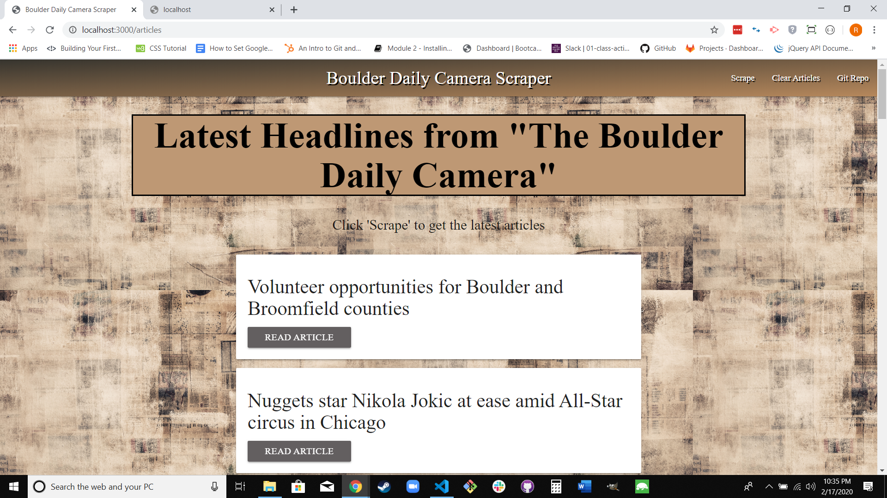

# Boulder Daily Camera News Scraper

This app allows user to view current Boulder Daily Camera articles. They may save their favorite articles, comment on favorites, and follow links to full articles on the Daily Camera website. They may also remove previously saved articles, clear all articles, and view the JSON objects for the full list.

[Live Demo]

## Dependencies

1. express
2. express-handlebars
3. body-parser
4. mongoose
5. request
6. cheerio

## Using App

These instructions will get you a copy of the project up and running on your local machine for development. I will assume that you already have [Node.js](https://nodejs.org/en/) and [MongoDB](https://www.mongodb.com/) installed locally. See deployment for notes on how to deploy the project on a live system.

1. Install dependencies. The package.json will install all dependencies for you if you run "npm install".
2. In terminal, enter **mongod** to initiate a mongo database.
3. Also in terminal, ensure you at at the root of directory and enter **node server.js**
4. Use browser to navigate to **http://localhost:3000**

## Screenshots

